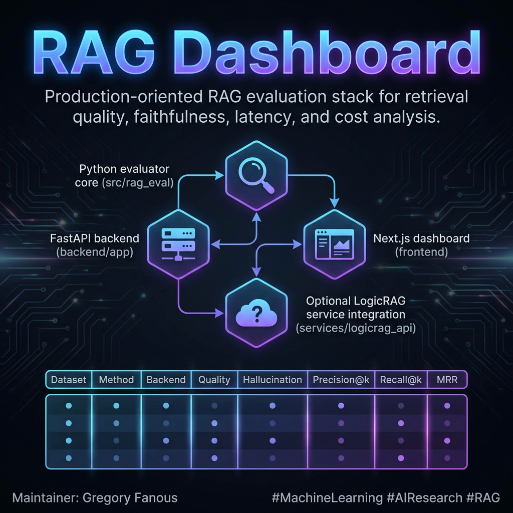

# RAG Dashboard

Production-oriented RAG evaluation stack for retrieval quality, faithfulness, latency, and cost analysis.

**Maintainer:** Gregory Fanous

## Dashboard Preview



## What this project includes

- Python evaluator core (`src/rag_eval`)
- FastAPI backend (`backend/app`)
- Next.js dashboard (`frontend`)
- Optional LogicRAG service integration (`services/logicrag_api`)

## Dataset policy

This repository does **not** redistribute third-party benchmark datasets.

All external datasets must be downloaded directly from their official Hugging Face dataset pages and used under each dataset's own license/terms.

Use:

```bash
python scripts/download_hf_datasets.py
```

Dataset details and source links are documented in `docs/DATASETS.md`.

## Optimization Findings

- Method sweep metrics report: [docs/reports/method_sweep_metrics.md](docs/reports/method_sweep_metrics.md)

## Quickstart

### 1. Environment

One-command setup:

```bash
./run_setup.sh
source .venv/bin/activate
```

Manual setup:

```bash
python -m venv .venv
source .venv/bin/activate
python -m pip install --upgrade pip
python -m pip install -e .
python -m pip install -r backend/requirements.txt
```

Install dataset downloader dependency:

```bash
python -m pip install huggingface_hub
```

### 2. Configure environment variables

```bash
cp .env.example .env
```

Populate `.env` with required API keys and runtime configuration.

### 3. Download datasets

```bash
python scripts/download_hf_datasets.py
```

This populates expected paths under `data/` for:

- `open_ragbench`
- `retrievalqa`
- `natural_questions`
- `paperzilla`
- `finder`
- `ragcare_qa`

### 4. Run services

Backend:

```bash
uvicorn backend.app.main:app --reload --host 0.0.0.0 --port 8000
```

Frontend:

```bash
cd frontend
npm install
NEXT_PUBLIC_API_BASE=http://127.0.0.1:8000 npm run dev
```

Open `http://127.0.0.1:3000`.

## Docker

```bash
docker compose up --build
```

## Tests

```bash
pytest
```

## CLI benchmark run

```bash
PYTHONPATH=src python -m rag_eval.cli run \
  --benchmark benchmarks/public_benchmark.json \
  --execution-mode real
```

## Repository layout

- `src/rag_eval` evaluator core
- `backend/app` API and orchestration
- `frontend` UI dashboard
- `scripts` operational scripts (including dataset download)
- `docs` setup and dataset documentation
